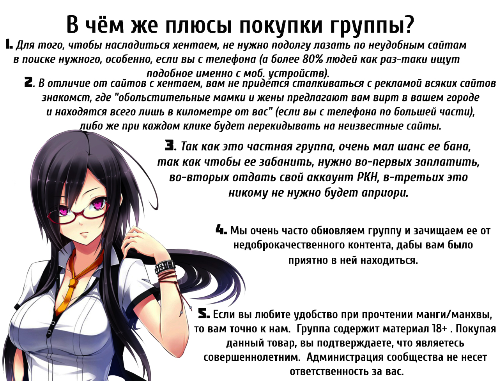

<!DOCTYPE html>
<html>
<head>
<meta charset="utf-8">
</head>
<body>

<html>
     <head>
          <meta charset="utf-8">
          <link rel="stylesheet" type="text/css" href="style.css" />
          <title>Слай-шоу HTML CSS</title>
     </head>
   

     <body>
          

               
               
               
            
          

     </body>
</html>
div id="scroll-bottom">

  <a href="#top"></a>

</body>
</html>

</body>
</html>

<h1>Отзывы</h1>

Немного простого текста

