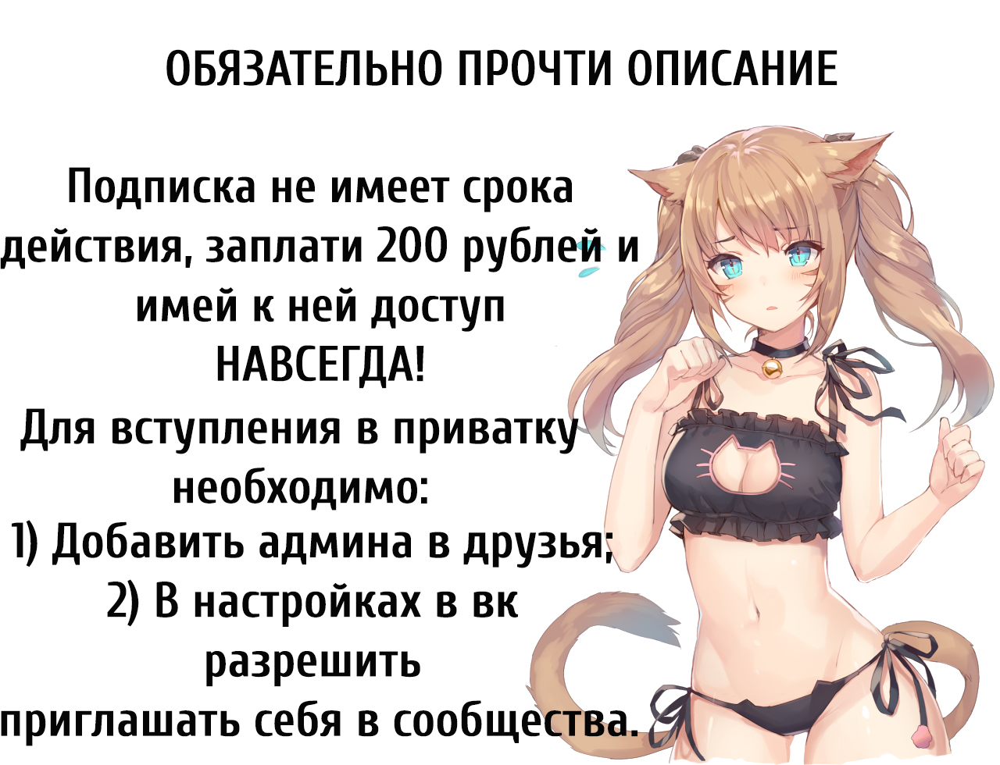

<!DOCTYPE html>
<html>
<head>
<meta charset="utf-8">
</head>
<body>

<html>
     <head>
          <meta charset="utf-8">
          <link rel="stylesheet" type="text/css" href="style.css" />
          <title>Слай-шоу HTML CSS</title>
     </head>
   

     <body>
          

               
               
               
            
          

     </body>
</html>
div id="scroll-bottom">

  <a href="#top"></a>

</body>
</html>

</body>
</html>

div class="container">
  <svg viewbox="0 0 48 48" >
    <path d="M 18 32.34 l -8.34 -8.34 -2.83 2.83 11.17 11.17 24 -24 -2.83 -2.83 z" stroke="#3da35a" fill="transparent"/>
  </svg>

<button><a href="https://vk.cc/9ZKeSf">Купить приватку</a></button>
<html>

<head>
  <title>Отзывы наших покупателей</title>
  <meta charset="UTF-8">
</head>

<body>
